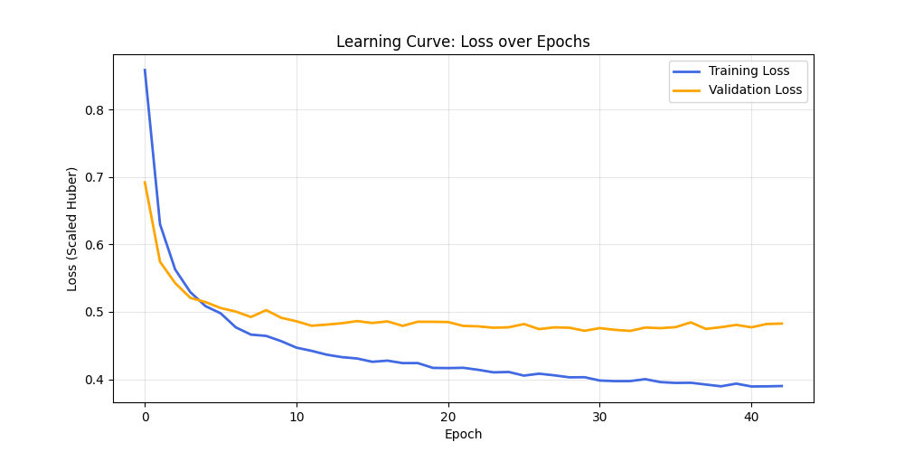
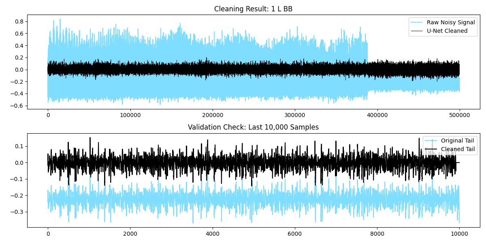
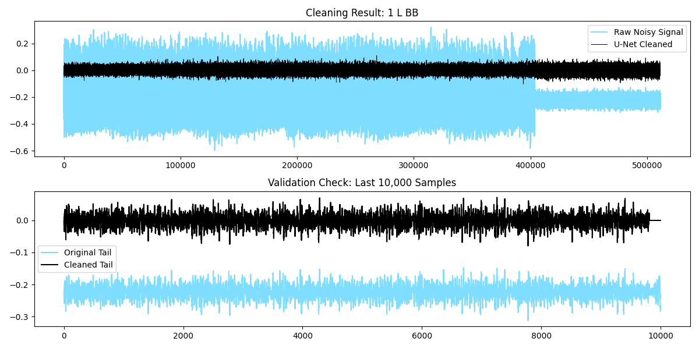

# Attention U-Net for EMG Denoising
Removing tSCS artifacts from EMG to clarify cutaneous reflexes

## Project Overview
During transcutaneous spinal cord stimulation (tSCS), large stimulation artifacts hide the EMG signal of interest. This project trains a 1D Attention U-Net to remove tSCS artifacts while preserving the underlying muscle activity.

## Approach
- **Artifact extraction:** tSCS spikes are detected in the stimulated recording with an adaptive threshold (standard deviation of an artifact-free tail × a muscle-specific factor). Each spike is isolated by subtracting a linear bridge across the spike window, giving a "pure" artifact trace.
- **Synthetic training pairs:** the extracted artifacts are added to a clean recording of the same muscle without stimulation. Input = clean EMG + artifact, target = clean EMG, so every training pair has an exact ground truth.
- **Model:** 1D Attention U-Net with 4 encoder/decoder levels and attention gates on the skip connections, which help the network focus on artifacts and protect the EMG.

## Project Structure
```text
├── config.py               # Paths (read from .env) and device selection (CUDA / Apple MPS / CPU)
├── .env.example            # Template for local data paths
├── data_loader.py          # Artifact extraction, synthetic mixing, PyTorch dataset
├── process.py              # EMG helper functions (offset removal)
├── model.py                # Attention U-Net 1D architecture
├── modules.py              # Encoder, decoder and attention-gate blocks
├── loss.py                 # Training loss (scaled Huber) and evaluation metrics
├── train.py                # Training with early stopping
├── validation_denoiser.py  # Evaluation on synthetic data (known ground truth)
├── test_denoiser.py        # Evaluation on real tSCS recordings + cleaned CSV export
└── visualization.py        # Learning curve and signal plots
```

## Dataset and Preprocessing
- **Signal:** 8-channel EMG (biceps, triceps, anterior and posterior deltoid, left and right), sampled at 2000 Hz
- **Normalization:** mean removal and max-abs scaling, so signal and artifact keep their amplitude ratio
- **Windows:** 400 samples (200 ms). At inference, windows overlap by 50% and are averaged, covering the full recording.

## Training
- **Loss:** Huber loss (β = 0.1), scaled ×500. It is robust to the large artifact spikes like MAE, but smooth for small errors like MSE.
- **Optimizer:** Adam, learning rate 1e-4, batch size 32
- **Early stopping:** stops after 10 epochs without validation improvement; the model with the lowest validation loss is kept
- **Participant split:**
  - Training (13): AA, DA, KM, JK, MT, NM, Re, SA, SH, Shn, TS, VI, VIm
  - Validation (2, early stopping only): NS, MY
  - Held-out test, never used for training or model selection: YK and MJ (synthetic data), MJ and Kn (real recordings)



Training and validation loss are both computed at the end of each epoch in evaluation mode.

## Evaluation
The model is evaluated in two ways:

1. **Synthetic data (ground truth known):** clean EMG + real extracted artifacts. The output can be compared with the true clean signal at every sample.
2. **Real tSCS recordings (no ground truth):** we measure how much the artifact spikes shrink, and whether an artifact-free segment at the end of each recording stays unchanged.

### Metrics
| Metric | Data | What it measures |
|---|---|---|
| RMSE before → after | Synthetic | Error compared with the true clean EMG, before and after cleaning |
| SNR improvement (dB) | Synthetic | The same error reduction in dB (+20 dB = 10× smaller error) |
| Correlation | Synthetic | Whether the cleaned signal has the same shape as the true EMG |
| RMSE in clean parts | Synthetic | How much the model changes samples that had no artifact (ideal: 0) |
| Peak reduction (dB) | Real | How much the artifact spikes shrink (−20 dB = 10× smaller) |
| Tail correlation | Real | Whether an artifact-free segment keeps its shape (ideal: 1) |

## Results

### Synthetic data
| | Training participants (n = 13) | Held-out participants (YK, MJ) |
|---|---|---|
| Error reduction | 88 ± 6% | 90 ± 2% |
| SNR improvement | 19.3 ± 3.4 dB | 20.2 ± 1.4 dB |
| Correlation with true EMG | 0.89 ± 0.06 | 0.84 ± 0.02 |
| RMSE in clean parts | 0.004 | 0.003 |

Artifact removal on held-out participants is as good as on training participants. Only waveform correlation is slightly lower, which matches the small gap between the training and validation loss.

### Real tSCS recordings (held-out participants MJ and Kn, 32 recordings)
| Muscle group | Peak reduction (median) | Tail correlation (median) |
|---|---|---|
| Anterior / posterior deltoid | −32.5 dB | 0.95 |
| Triceps | −21.5 dB | 0.99 |
| Biceps | −15.2 dB | 1.00 |





The removed component (raw − cleaned) shows what the model took out of the signal. It should contain only the stimulation spikes, not muscle activity.

## Limitations
- Biceps artifacts are smaller relative to the EMG, so there is less to remove and the peak reduction is lower.
- One deltoid channel shows reduced tail correlation, meaning some change to artifact-free signal.
- Only 2 participants are fully held out (YK and MJ for synthetic data, MJ and Kn for real recordings); leave-one-subject-out cross-validation would give a stronger estimate.

## How to Run
```bash
python -m venv .venv
source .venv/bin/activate
pip install torch numpy pandas scipy matplotlib tqdm python-dotenv

cp .env.example .env        # then fill in your data paths

python data_loader.py          # build synthetic training windows (.pt files) from raw recordings
python train.py                # train the model
python validation_denoiser.py  # synthetic evaluation
python test_denoiser.py        # real-recording evaluation and cleaned CSV export
```

Data and trained weights are not included in this repository.